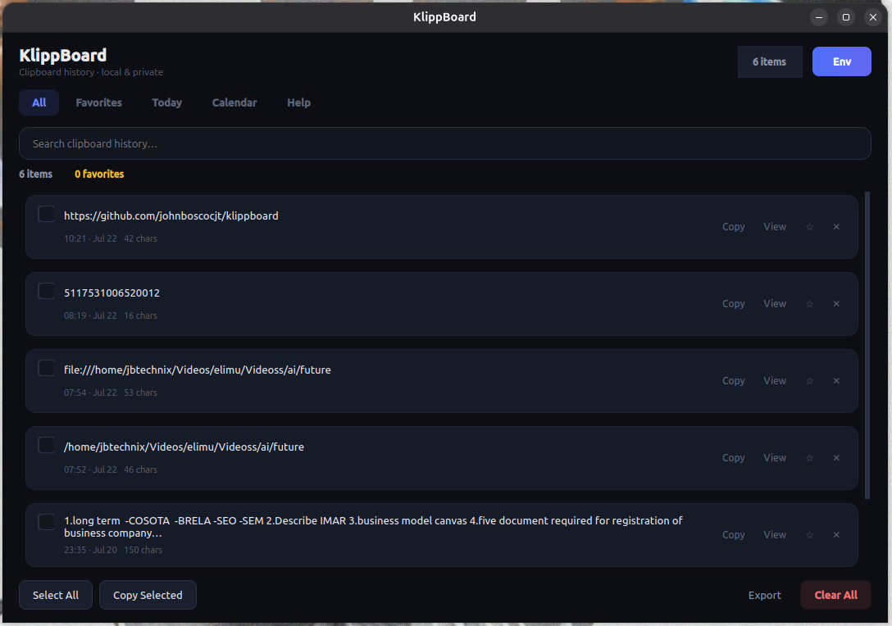
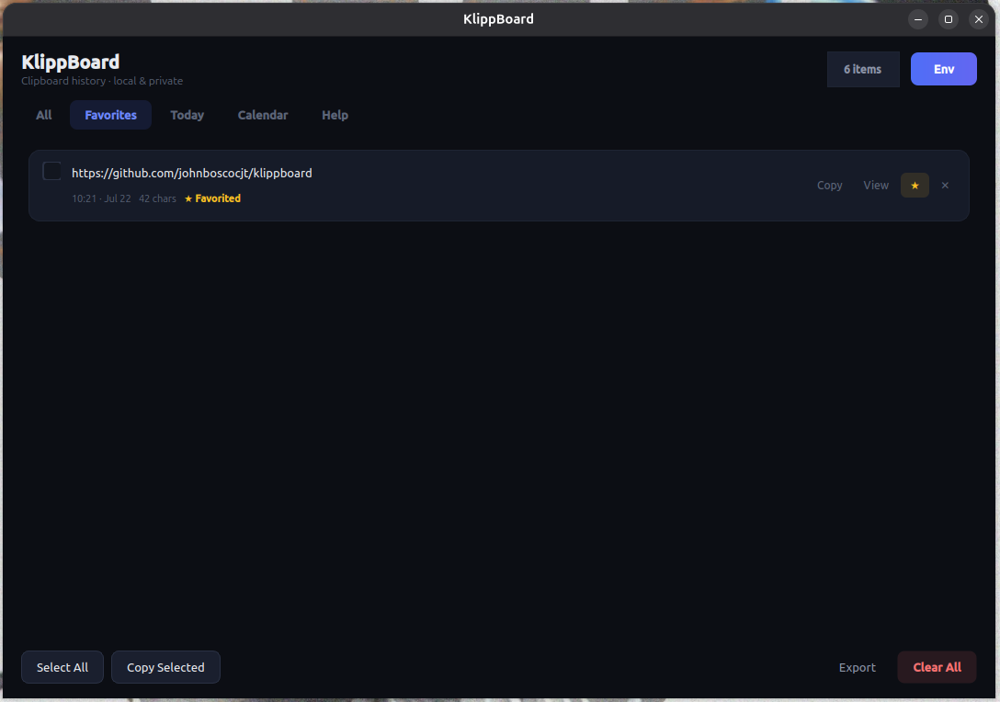
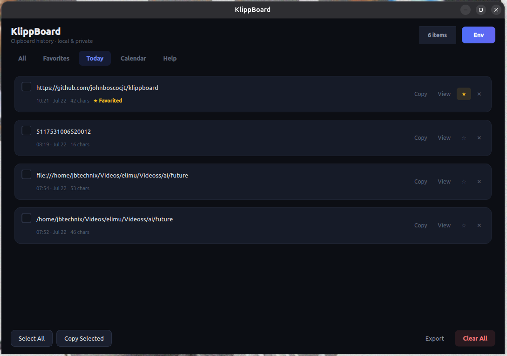
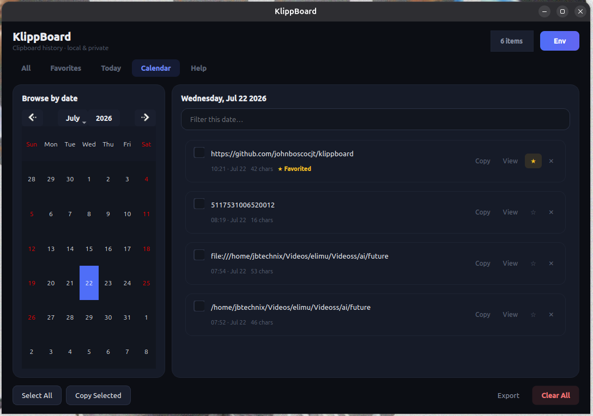
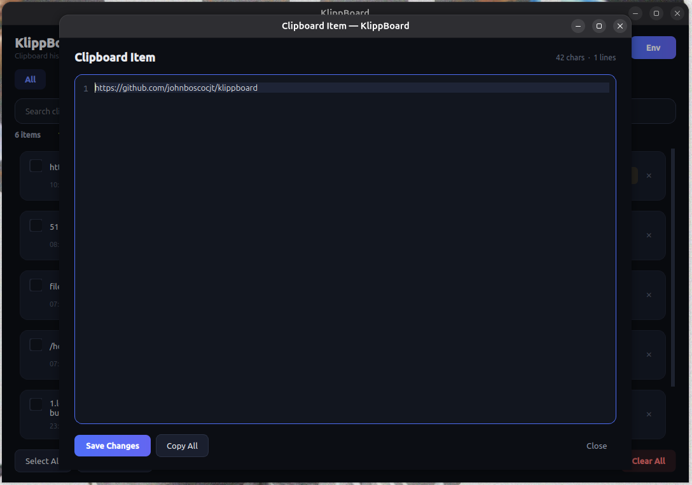
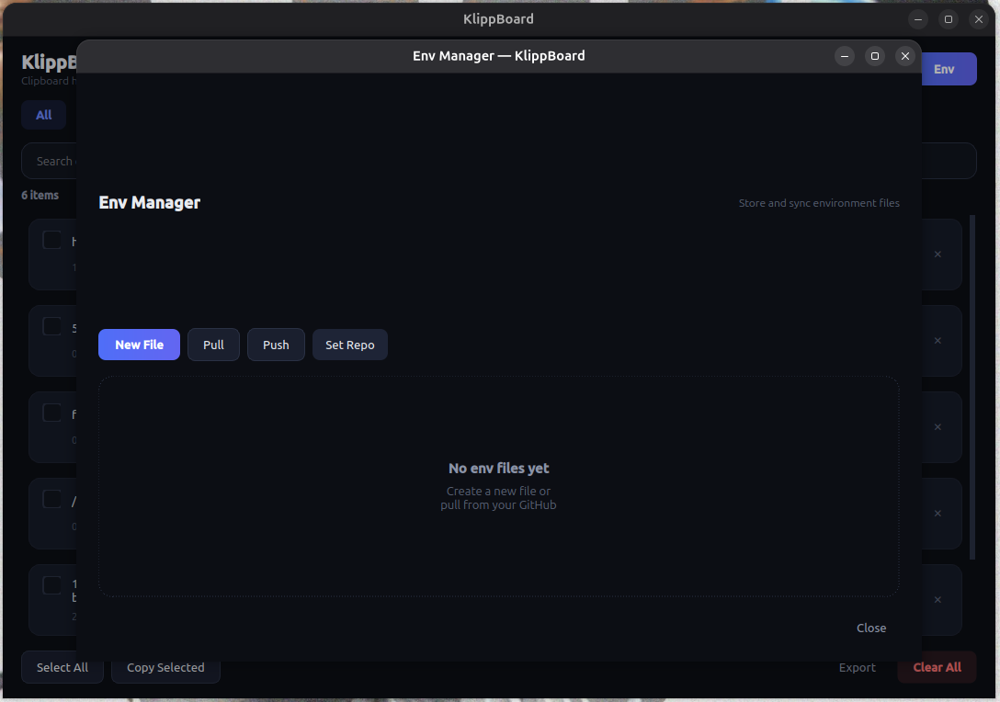
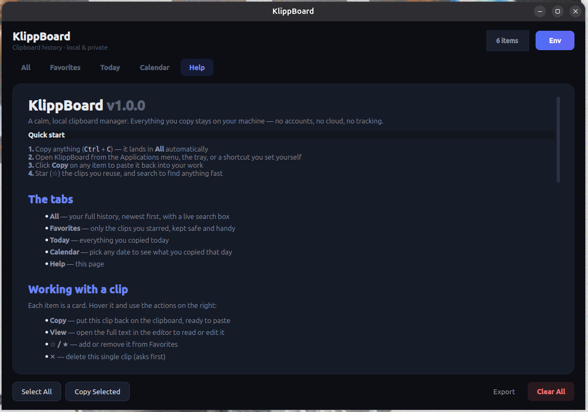

# KlippBoard v1.0.0

**A modern, local clipboard manager for Linux** — history, favorites, calendar browse, env-file sync, and a clean dark UI.

> Made with love by [johnboscocjt](https://github.com/johnboscocjt/)

[](https://www.python.org/)
[](https://opensource.org/licenses/MIT)

## Screenshots

**All** — every copy lands here automatically. Search, select, star, or open any clip.



**Favorites** — clips you starred, kept one click away.



**Today** — only what you copied today.



**Calendar** — pick a date on the left; that day’s clips appear on the right.



**Viewer** — full editor with line numbers, character count, save, and copy.



**Env Manager** — store and sync `.env` files (New File, Push / Pull, Set Repo).



**Help** — built-in guide covering tabs, actions, shortcuts, and privacy.



## Key Features

### Clipboard Management
- Real-time clipboard monitoring
- 100-item history
- Persistent local JSON storage
- Fast search and filtering
- 5-tab interface (All · Favorites · Today · Calendar · Help)

### Quick Actions
- **Copy** — one-click copy back to clipboard
- **View** — open in editor with line numbers
- **Delete** — remove items
- **Favorite** — star clips you reuse often

### Interface
- Dark-minimal theme
- Line numbers + character/line count in the editor
- Quiet toast feedback (no popup spam)
- App icon on window, tray, and Applications menu

### Privacy First
- 100% local (no cloud)
- No tracking/telemetry
- Open source (MIT License)

## Quick Start

### Install

```bash
git clone https://github.com/johnboscocjt/klippboard.git
cd klippboard
bash install.sh
klippboard
```

### Set a keyboard shortcut (recommended)

KlippBoard does not register a hotkey by itself. Add one in your desktop settings:

1. Open **Settings → Keyboard → Custom Shortcuts** (GNOME)  
   or the equivalent on KDE / XFCE / Cinnamon
2. Add a new shortcut:
   - **Name:** KlippBoard  
   - **Command:** `klippboard`  
   - **Keys:** e.g. `Ctrl+Alt+V`
3. Save — press that combo anytime to open KlippBoard

Full steps for each desktop: [INSTALLATION.md](INSTALLATION.md#set-a-keyboard-shortcut-manual)

### Manual run

```bash
python3 clipboard_manager.py
```

### Uninstall

```bash
bash uninstall.sh          # keep your data
bash uninstall.sh --purge  # also delete history + env files
```

## How to Use

### Select & manage items
- Click the checkbox to select items
- **Select All** — select everything in the current tab
- **Copy Selected** — copy checked items together
- **Export** — save history to a `.txt` file
- **Clear All** — delete everything (double confirmation)

### View & edit
- Click **View** to open the editor
- Line numbers on the left
- Character & line count in the header
- Save changes back to history

### Search & filter
- Search in the All tab
- Search within a selected calendar date
- Live, case-insensitive filtering

### Calendar
- Pick a date on the left
- See that day's clips on the right
- Filter within the selected date

## Technical Specs

- **Language**: Python 3.7+
- **Framework**: PyQt5
- **Dependencies**: PyQt5
- **Memory**: ~50–70 MB
- **Startup**: &lt; 2 seconds
- **License**: MIT

## Files

- `clipboard_manager.py` — main application
- `klippboard.png` — app / launcher / tray icon
- `clipboardpictures/` — screenshots used in this README
- `install.sh` — installer
- `uninstall.sh` — uninstaller (`--purge` to remove data)
- `INSTALLATION.md` — setup + keyboard shortcut guide
- `UNINSTALL.md` — removal guide
- `FEATURES.md` — full feature list
- `PRIVACY.md` — privacy policy
- `README.md` — this file
- `LICENSE` — MIT License

## Privacy

- **100% Local** — data in `~/.clipboard_history.json`
- **No Cloud** — never phones home
- **No Tracking** — zero telemetry
- **Open Source** — full source available

See [PRIVACY.md](PRIVACY.md) for details.

## Troubleshooting

### `command not found: klippboard`
```bash
source ~/.bashrc
which klippboard
```
Re-run `bash install.sh` if the command is missing.

### Keyboard shortcut does nothing
- Confirm `klippboard` works in a terminal first
- In your custom shortcut, set Command to `klippboard` (or `/usr/local/bin/klippboard`)
- Pick a key combo that is not already used

More help:
- [INSTALLATION.md](INSTALLATION.md)
- [PRIVACY.md](PRIVACY.md)
- Help tab inside the app

## License

MIT License — see [LICENSE](LICENSE)

## Author

**johnboscocjt** — [GitHub](https://github.com/johnboscocjt/)
